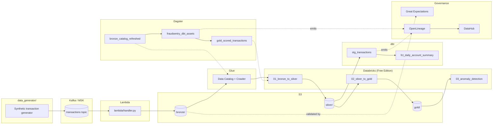

# Architecture

## Notes

- **MSK is not always-on.** It's provisioned only for short demo
  sessions (`infra/msk.tf`, gated by `var.enable_msk`); day-to-day
  development runs against local Kafka (`ingestion/docker-compose.yml`).
  The producer/consumer code is identical either way -- only the
  bootstrap-servers endpoint changes.
- **Databricks Free Edition** (Community Edition was retired
  2026-01-01) is serverless-only and quota-limited, but does include
  Unity Catalog and Jobs -- so the Dagster -> Databricks edge
  (`O3 -.-> N1`) is expected to be a real API call, not a manual step.
  The open question is the `C --> N1` edge: whether Free Edition can
  read the S3 bronze layer via a UC external location, or whether data
  needs staging into a UC Volume first. See `databricks/README.md`.
- **Two catalogs, on purpose.** Glue catalogs the S3 side (and is what
  the Dagster crawler asset refreshes); Unity Catalog governs the
  Databricks side and supplies column-level lineage. They meet at the
  bronze layer.
- Quality is layered: per-record validation at ingestion
  (`common/validation.py`, shared by the local consumer and the Lambda
  handler), then aggregate checks on landed bronze data (Great
  Expectations), then dbt schema + singular tests on the
  staging/marts layer.
